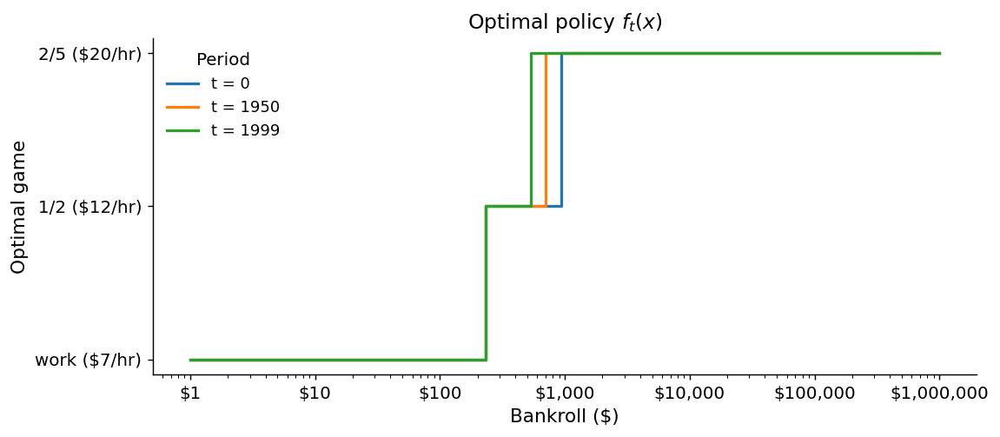
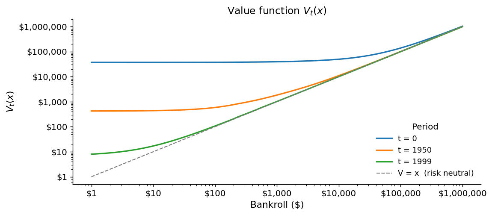
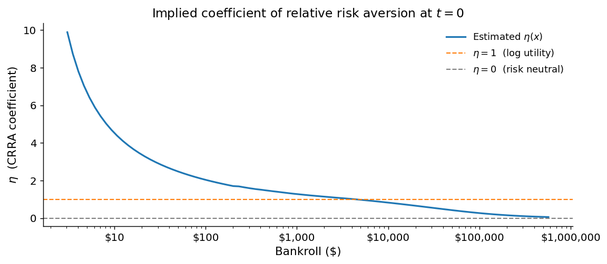
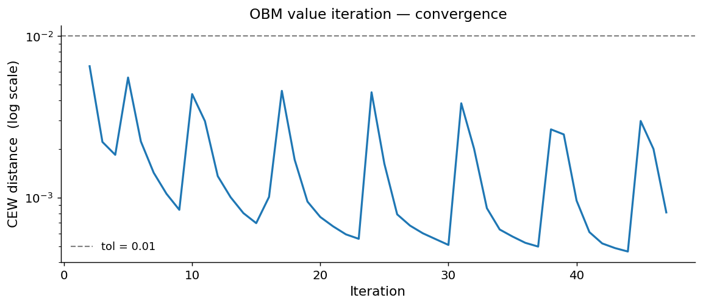
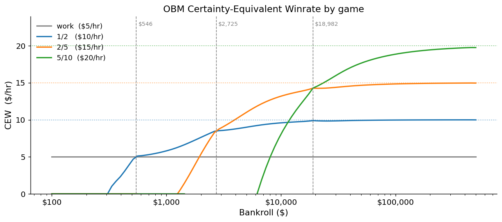
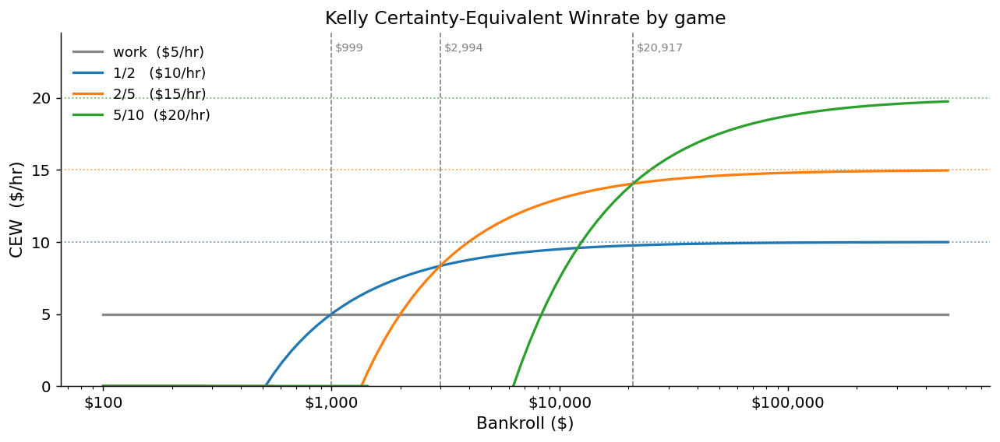
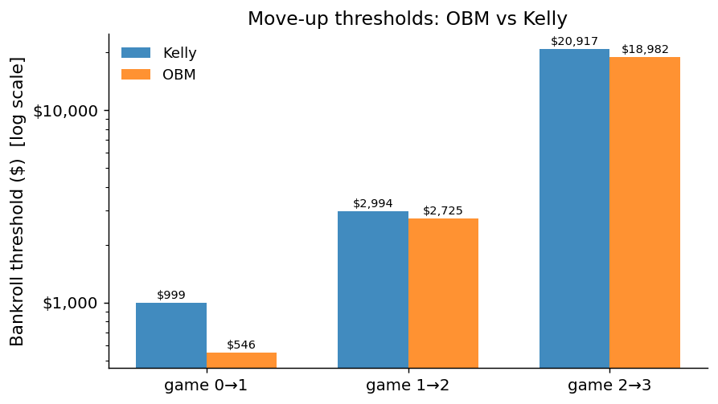

## Introduction

A poker player deciding which game to sit in faces a problem that looks simple but is not: should I play 1/2, move up to 2/5, or take an outside option like working a regular job? The obvious answer — play whichever game has the highest expected hourly winrate — is wrong.

The reason is that money does two different things for a poker player. It is a **consumption good** in the ordinary sense, but it is also a **capital good**: a larger bankroll gives access to higher-stakes games, which convert time into money at a higher rate. Moving from 1/2 to 2/5, for example, roughly doubles the hourly dollar stakes and (if you have an edge) your expected hourly earnings. This means that a dollar lost at 1/2 costs more than just a dollar — it delays or forecloses the move up to 2/5, destroying option value on top of the direct loss.

This asymmetry — losses are more costly than equivalent gains because of the option value they destroy — makes a player who is completely indifferent to risk in their final wealth *behave as if risk-averse* when choosing which game to play. The optimal bankroll manager is not risk-averse by assumption; they are risk-averse because the math forces it.

This document presents two models for finding the optimal game-selection rule. The **finite-horizon DP** solves the problem by backward induction over a fixed time horizon. The **infinite-horizon OBM** finds a stationary policy via value iteration, using the Certainty-Equivalent Winrate (CEW) as its central output. Both are benchmarked against the **Kelly criterion**, the standard log-utility benchmark in gambling and finance.

---

## The Finite-Horizon Model

### Setup

The player starts each period with bankroll $x$ and picks one of $N$ games. The state evolves according to a simplified Bernoulli transition: with probability $p_i = (\sigma_i / B_i)^2$ the player wins or loses a full buyin $B_i$; otherwise the bankroll shifts by the mean gain $\mu_i$. The player cannot sit in a game they cannot afford. At the end of $T = 2000$ periods the player cashes out, and the terminal payoff is simply the bankroll — no curvature, no risk aversion built in by assumption.

The model is solved by backward induction: starting from the known terminal value, the program works backwards one period at a time, computing the best game at each bankroll level.

### Game parameters

The baseline calibration covers three options.

| Game | Buyin $B$ | Mean gain $\mu$ ($/hr) | Std dev $\sigma$ ($/hr) |
|------|----------:|----------------------:|------------------------:|
| Work (outside option) | — | 7 | 0 |
| 1/2 NL | 200 | 12 | 80 |
| 2/5 NL | 500 | 20 | 250 |

Work is a risk-free outside option available at any bankroll. The 1/2 game is the next step up — higher EV but with variance — and 2/5 offers higher EV still, but requires a larger bankroll to absorb the swings.

### Optimal policy and value function

The two panels below show the optimal game at each bankroll (left) and the value function (right) for three representative time periods: $t = 0$ (far from the horizon), $t = 1950$ (50 periods remaining), and $t = 1999$ (final period).

::: {.columns}
::: {.column width="50%"}

:::
::: {.column width="50%"}

:::
:::

At $t = 0$, the optimal policy switches from 1/2 to 2/5 at a bankroll of roughly **\$811–\$933**. As the horizon shrinks (moving from $t = 0$ toward $t = 1999$), the thresholds shift left — the player becomes more willing to take risk because there is less time for the optionality of higher stakes to pay off. By the final period, the player plays whichever game has the highest raw EV, because with one period left there is no future optionality to protect.

### Implied risk aversion

Even though the model assumes a risk-neutral terminal payoff, it generates endogenous risk aversion in game selection. The figure below recovers this implied risk aversion by asking: what CRRA utility function $u(x) = x^{1-\eta}/(1-\eta)$ would produce the same curvature as the observed value function at each bankroll level?

At a bankroll of \$1,000, the implied $\eta$ exceeds 1 — the player is *more* risk-averse than a log-utility agent because the option value of 1/2 is large relative to the current stake. As the bankroll grows into the hundreds of thousands, $\eta$ falls close to zero: the player is nearly indifferent between games because their bankroll is large enough that no move-up threshold binds. The curvature is entirely a product of the discrete game choices, not of any assumption about preferences.

---

## The Infinite-Horizon OBM Model

### Setup and the CEW metric

The finite-horizon model gives the right answer for a fixed window, but poker is not a finite game. The infinite-horizon OBM drops the time horizon and finds a stationary policy — one that is optimal to follow forever.

The algorithm works by value iteration: start with an initial guess for the value function, compute the best game at each bankroll, update the value function, and repeat until convergence. Rather than tracking convergence in value-function units, the model uses the **Certainty-Equivalent Winrate (CEW)** as its main metric.

The CEW at bankroll $x$ for game $n$ is the fixed dollar amount per period that makes the player exactly indifferent between accepting it and playing game $n$ under the current value function. It is a bankroll-adjusted winrate: a game with high variance but high upside may have a low CEW at small bankrolls (when ruin risk is real) but a high CEW at large bankrolls (when variance is manageable). The optimal game at any bankroll is simply the one with the highest CEW.

### Kelly as a benchmark

The Kelly criterion is the special case where the value function is $\log(x)$ — that is, the player maximises expected log bankroll each period without looking ahead. Kelly has a closed-form solution (no iteration needed) and serves as the natural one-shot benchmark. The difference between Kelly and OBM CEW curves quantifies how much the recursive model's full pricing of future optionality changes the answer.

### Game parameters

The infinite-horizon model uses four games.

| Game | Buyin $B$ | Winrate $w$ ($/hr) | Std dev $\sigma$ ($/hr) | Min viable bankroll |
|------|----------:|-------------------:|------------------------:|--------------------:|
| Work | — | 5 | 0 | — |
| 1/2 NL | 100 | 10 | 100 | \$300 |
| 2/5 NL | 200 | 15 | 200 | \$600 |
| 5/10 NL | 500 | 20 | 500 | \$1,500 |

A game is only available when the bankroll exceeds twice the buyin and three standard deviations — below this the risk of ruin within a session is too high to model with normal approximation.

### Convergence

Value iteration converges in 47 iterations, taking under a second. The convergence plot below shows the max relative change in CEW per iteration (starting from iteration 2, after the large initial jump from the Kelly starting point).

### CEW curves and thresholds

The two panels below show the CEW for each game under OBM (left) and Kelly (right). The dotted horizontals mark each game's true hourly EV; the dashed verticals mark the move-up thresholds.

::: {.columns}
::: {.column width="50%"}

:::
::: {.column width="50%"}

:::
:::

Both models agree qualitatively: each game has a bankroll range where it is optimal, and the crossings define the move-up thresholds. The curves differ in shape — OBM CEW rises more steeply at low bankrolls because the recursive model prices the near-term option value more aggressively.

### OBM vs Kelly thresholds

| Transition | Kelly threshold | OBM threshold | OBM / Kelly |
|------------|---------------:|--------------:|------------:|
| Work → 1/2 | \$999 | \$546 | 0.55× |
| 1/2 → 2/5  | \$2,994 | \$2,725 | 0.91× |
| 2/5 → 5/10 | \$20,917 | \$18,982 | 0.91× |

OBM recommends moving up earlier at every transition, and the effect is largest at the first step. At a bankroll of \$546 — barely half what Kelly would suggest — the OBM player should already be sitting in the 1/2 game rather than working. The gap narrows at higher transitions (around 9% earlier rather than 45% earlier) because at larger bankrolls the marginal option value of the next game is smaller relative to current stakes.

The direction of this result is intuitive once you think about it carefully. Kelly ignores what happens after the current period — it just maximises the growth rate of this period's bankroll. OBM sees that moving up sooner accelerates the journey to the next threshold, and prices that acceleration into the current decision. The result is a policy that is more aggressive about moving up but for economically coherent reasons, not out of recklessness.

---

## Conclusion

Two complementary models of optimal bankroll management reach consistent conclusions.

**Endogenous risk aversion.** A player who is perfectly indifferent to risk in their final wealth will nonetheless behave as if risk-averse when choosing games. The source of this risk aversion is entirely the option value of higher stakes: losing a buyin is worse than winning one is good, because losses delay the move up. The implied coefficient of relative risk aversion exceeds log utility at low bankrolls and declines toward zero as the bankroll grows — a clean prediction that could, in principle, be tested against actual player behavior.

**OBM vs Kelly thresholds.** The recursive OBM model recommends moving up significantly earlier than Kelly at the first game transition (at 55% of the Kelly threshold) and modestly earlier at subsequent transitions (around 91%). Kelly is a useful benchmark and easy to compute, but it systematically overestimates how large a bankroll you need before moving up, because it does not account for the compounding value of getting into a higher game sooner.

Several natural extensions are left for future work. **Living expenses** introduce a withdrawal from the bankroll each period, which makes ruin a real absorbing state and tilts the policy toward more conservative game selection. **Occasional high-stakes invitations** — a 5/10 game that appears randomly — can be incorporated as an additional game choice available with some probability each period, and the model will price the option of accepting or declining. **Tournament settings** change the structure fundamentally: the prize is non-linear in finishing position, buyins are discrete and large relative to the bankroll, and re-entry decisions add another layer of optionality. Each of these extensions fits naturally within the dynamic programming framework developed here.
